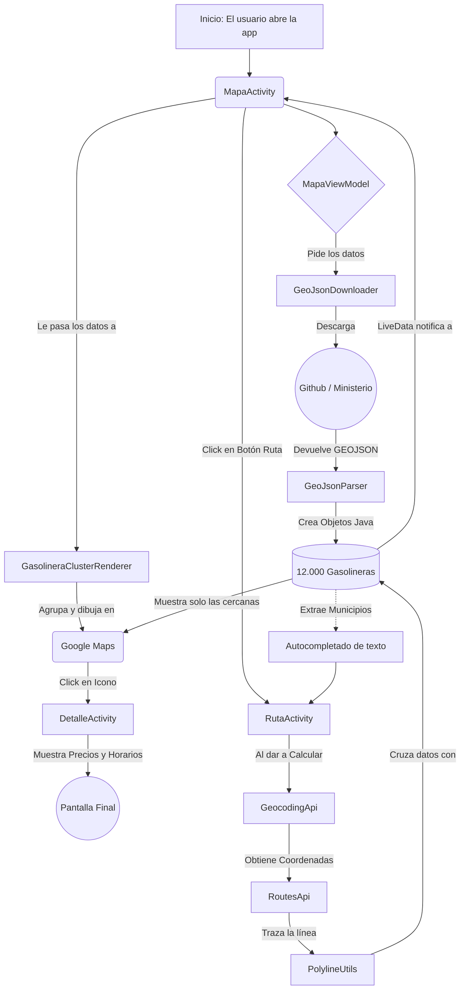

# Arquitectura y Flujo: Gasolineras España 🗺️⛽

¡Por supuesto! Como inteligencia artificial, puedo generarte gráficos y diagramas de flujo interactivos usando el formato estándar conocido como **Mermaid**.

A continuación tienes un diagrama de cómo la información fluye por tu aplicación desde que la abres hasta que calculas una ruta:

## 1. Diagrama de Flujo de la App

---

## 2. Explicación de tu Código

Has conseguido organizar el código usando un patrón de diseño muy profesional y moderno llamado **MVVM (Model-View-ViewModel)** junto con una estructura de paquetes muy limpia. Te detallo qué hace cada "pieza" de tu motor:

### 🧩 El Cerebro: `MapaViewModel`
En lugar de descargar los datos directamente en la pantalla, usas un *ViewModel*. Esto es brillante porque **sobrevive a los giros del teléfono**. Si el usuario gira la pantalla, la Actividad (UI) se destruye y se vuelve a crear, pero el ViewModel "vive" en la memoria y le pasa la lista de gasolineras al instante sin tener que volver a descargarlas de internet. 

### 🌐 El Motor de Datos: `.geojson`
En este paquete tienes el `GeoJsonDownloader` y el `Parser`. Se ejecutan en un **hilo secundario** (fuera del hilo principal) para que la pantalla de la app no se quede "congelada" mientras procesa megabytes de texto descargado. Convierten puro texto Json en miles de objetos Java tipo `Gasolinera`.

### 📍 Pinceles y Dibujo: `.cluster`
Dibujar 12.000 pines de golpe en Google Maps haría que cualquier móvil explotara. Para evitar eso has metido:
- **`GasolineraClusterItem`**: Representa un "puntito" matemático en el mapa.
- **`GasolineraClusterRenderer`**: Tira de magia para detectar cuándo los puntos están muy cerca y agruparlos en círculos de colores con números (clusters) y cuándo dibujarlos individualmente.

### 🚗 Navegación: `.rutas`
Este es el módulo que montaste recientemente:
- **`GeocodingApi`**: Un "traductor" que coge palabras en español (ej. "Madrid") y las convierte en coordenadas matemáticas puras `(40.4168, -3.7038)`.
- **`RoutesApi`**: Habla con los servidores de Google para pedirles que calculen el asfalto que une dos puntos geográficos.
- **`PolylineUtils`**: Recibe una línea matemática codificada súper extraña y la "dibuja" en azul, a la vez que calcula si hay gasolineras a menos de 5Km de esa raya azul.

### 📱 Las Vistas: `MapaActivity`, `DetalleActivity` y `RutaActivity`
Sirven puramente como controladores de la interfaz gráfica: Muestran lo que el ViewModel les dice que muestren, abren pantallas y escuchan si tocas los botones.

> [!TIP]
> **Buenas Prácticas:** Al separar la 'lógica de descarga', de 'la pura pantalla UI' y de la 'lógica de clustering', consigues que el día que quieras cambiar el aspecto físico de la app, no tengas que tocar cómo se descargan los datos. ¡Es un código muy sólido!
